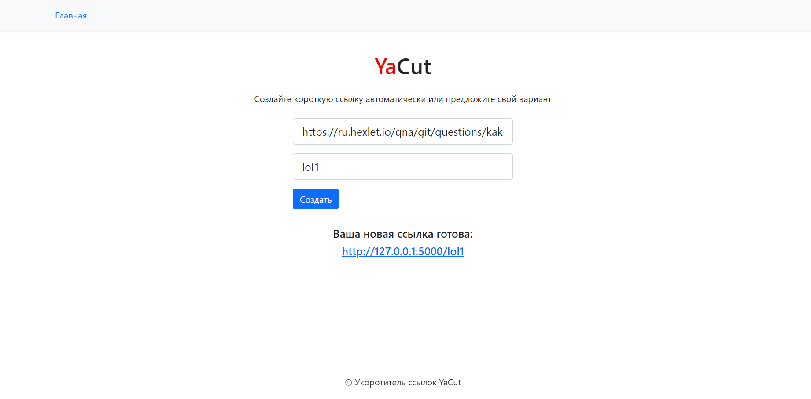

# Сокращение ссылок YaCut

---
## О сервисе YaCut
Проект **YaCut** — это сервис укорачивания ссылок. Его назначение — ассоциировать длинную пользовательскую ссылку с короткой, которую предлагает сам пользователь или предоставляет сервис.

## Технологии
- Python 3.9
- Flask

## Установка:
- Клонируйте проект парсера на свой компьютер:
```
git@github.com:hydrospirt/yacut.git
```
- Установите и активируйте виртуальное окружение
```
py -3.9 -m venv venv
```
Для Windows:
```
source venv/Scripts/Activate
```
Для Linux
```
source venv/bin/activate
```
- Установите зависимости из файла requirements.txt
```
python3 -m pip install --upgrade pip
pip install -r requirements.txt
```
## Инструкции для запуска
Для запуска парсера используте комманду:
```
flask run
```

> Используйте https://editor.swagger.io/ для просмотра документации к API.
> Файл с документацией в репозитории: **openapi.yaml**

# Автор
Эдуард Гумен - [Cтраница GitHub](https://github.com/hydrospirt)
